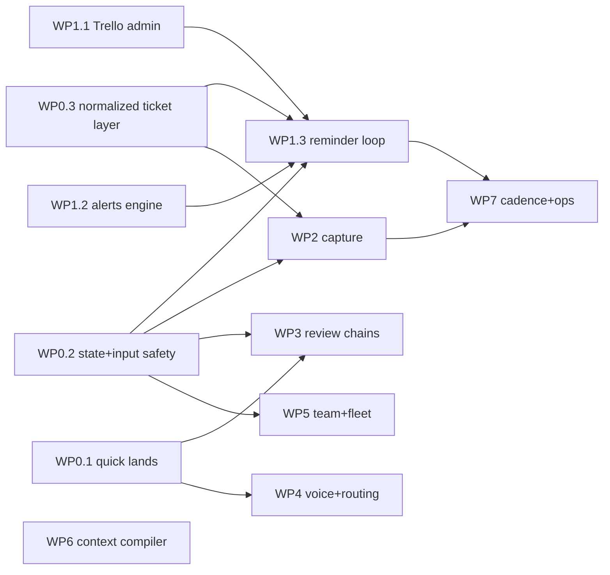

# Final implementation plan

This is the authoritative build document. It integrates three independent reviews of the
plan folder (a Fable strategic review, an Opus engineering review, a Codex gpt-5.6-sol
high-effort review; 47 findings total, every one dispositioned) plus targeted
re-verification of disputed facts. Where any other doc in this folder conflicts with
this one, this one wins.

Review verdicts: Fable fix-then-ship, Opus fix-then-ship, Codex rework. The rework items
are all incorporated below as work-package requirements, not deferred.

## The spine

One path must work even if everything else is ignored, and it gets built first:

```
someone says or posts a commitment
  -> a dated Trello card exists (capture or triage proposal)
  -> the reminder loop sees it (leader instance only, dead-man-switched)
  -> the owner and Discord get told, on a budget, until a human decides
```

Everything else (voice, reviews, fleet, context compilation) hangs off that spine and
is allowed to slip; the spine is not.

## Security invariants (apply to every work package)

1. **External text is data, never instructions.** Card titles/descriptions, Discord
   messages, PR bodies, and reviewer output are untrusted. Wherever they enter a prompt
   they are fenced, length-capped, marked untrusted, and stripped of CR/ESC/C0 control
   bytes before any PTY write.
2. **No auto-launch of write-capable agents from externally sourced text.** A card may
   only launch without a human click if it carries an auto-eligible marker that can be
   set solely in the orchestrator UI by a human. Capture bots and the triage agent can
   never set it. Card origin (author, source channel, content hash) is stamped into the
   task record at capture.
3. **Reviewer verdicts are structured, bound, and posted by the trusted parent.**
   Reviewers run read-only and return strict JSON to the parent process. The parent
   validates exit status, schema, stage, per-run nonce, and the PR head SHA, then posts
   the GitHub review itself. Any head change invalidates all passes. Free-text VERDICT
   scraping is banned (the current first-match regex is exploitable by PR content).
4. **Agent-to-agent text is quoted.** Reviewer summaries or any agent output forwarded
   to a permissioned session goes through the same fencing as external text, or lands in
   the review inbox for a human instead of auto-forwarding.
5. **Per-peer, per-capability credentials for anything cross-machine.** No shared bearer
   token, no tokens in query strings, no caller-supplied identity headers. Peers get
   hashed revocable credentials scoped to capabilities (`read-limits`,
   `request-launch`). Remote launch requests require local acceptance. Terminal-input
   and general session endpoints are never proxied.
6. **Local API surface is gated.** `/api/commander/send-to-session` (and siblings that
   write to PTYs) get route-level auth in the same PR that removes the Discord bot's
   bypass. Removing one caller does not close an endpoint.
7. **Roles select instructions, never permissions.** The context compiler changes what
   an agent reads, not what it may do. Auto-merge rights and auto-launch markers live in
   config protected by the supervisor's path-deny rules so an agent cannot widen its own
   authority.

## Operational invariants

1. **One automation leader.** Exactly one orchestrator instance per shared data dir runs
   automations (reminders, PR polling, triage, recurrence), enforced by a lease file,
   not by memory. Dev instances get their own data dir with external writes off.
2. **Atomic state.** Every JSON store write is tmp-file plus rename, with
   reload-before-write or an advisory lock. `taskRecordService`'s read-once,
   overwrite-whole-file behavior is fixed before any new state rides on it.
3. **One data dir.** Migrate and merge `~/.orchestrator` into `~/.agent-workspace` once
   (task records: 28-record legacy store + 1-record new store; `voice-registry.json`;
   the `workspaceDirectory` pointer in config.json), then pin `AGENT_WORKSPACE_DIR`.
   The count-based auto-flip heuristic is a live hazard until then.
4. **API budget.** All Trello callers (UI, batch launch, PR poll, reminder loop, triage,
   auto-trello) share one token bucket with Retry-After backoff in the provider layer.
   Trello allows 300 req/10s per key, 100 req/10s per token.
5. **Dead-man switch.** The reminder loop posts a daily digest even when empty, so
   silence is itself an alarm. Its own failure alerting is part of its spec (the
   auto-trello silent-401 months are the precedent).
6. **Settings live in the data dir, not the checkout.** `global.ui.tasks.*`
   (boardMappings, conventions, automations) moves out of the per-worktree gitignored
   `user-settings.json`; otherwise every checkout, machine, and teammate re-enters
   twelve boards by hand and the dev instance sees none of prod's config.

## Core schemas (write these before the code that uses them)

**Normalized ticket** (WP0.3; every consumer above the provider uses this, never raw
Trello JSON):

```json
{ "id": "trello:shortLink | issue:owner/repo#N", "provider": "trello",
  "boardId": "", "url": "", "title": "", "description": "",
  "status": "inbox|backlog|ready|in_progress|review|blocked|done",
  "due": "ISO8601|null", "dueComplete": false, "priority": 0,
  "assignees": [], "labels": [], "attachments": [], "commentsUrl": "",
  "origin": { "author": "", "channel": "", "contentHash": "" },
  "revision": "opaque change token" }
```

**Alert occurrence** (reminder loop state; one record per alert, never per card):

```json
{ "cardId": "", "dueRevision": "", "kind": "due_soon|due_day|overdue|blocked_review|no_date|dead_man",
  "channel": "ui|discord|phone", "scheduledAt": "", "sentAt": null,
  "status": "pending|sent|suppressed|failed", "attempts": 0, "instanceId": "" }
```

**Triage proposal** (pattern copied from Atlas proposals, separate store):

```json
{ "id": "", "cardId": "", "kind": "priority|due|duplicate|conflict|route",
  "proposal": {}, "reason": "", "evidence": [], "idempotencyKey": "cardId:kind:inputsHash",
  "status": "pending|approved|rejected|auto_applied", "createdAt": "", "decidedBy": "" }
```

**Limits window** (replaces the wrong `fiveHour/sevenDay` universal claim; Codex and
Grok already return window arrays):

```json
{ "schema": 2, "member": "", "machine": "", "observedAt": "", "stale": false,
  "windows": [ { "provider": "claude|codex|grok", "bucket": "5h|7d|weekly_model|spark",
    "label": "", "usedPercent": 0, "resetsAt": "" } ],
  "available": { "claude": true, "codex": false, "grok": true } }
```

Routing treats `available: false` as "unknown", never as "drained".

**Prompt artifact** (hand-off; consumed by batch launch, which today reads only
title+description and must learn to read this):

```json
{ "schema": 1, "cardId": "", "author": "", "createdAt": "", "expiresAt": "",
  "contentHash": "", "prompt": "", "model": "", "effort": "",
  "location": "task-record + card attachment named prompt.json" }
```

Launch uses a card-scoped lease `{cardId, nonce, machine, expiresAt}` rechecked
immediately before spawn, so two machines assigned to one person cannot double-launch.
The launch outcome is written back to the card as a comment (machine, session id,
timestamp, resulting branch/PR when known), so the cross-machine audit trail lives on
the shared card, not only in per-machine task records.

**Interruption policy** has exactly one owner: `config/interruption-policy.json`,
consumed by both the supervisor and the reminder loop (shared budget, shared quiet
hours, separate digest queues). The three conflicting cadence descriptions in the other
docs defer to it. Supervisor urgency formula, stated explicitly:
`score = clamp(round(severityBase * tierWeight * priorityWeight) + blocksWork*20 + min(attempts,5)*12, 0, 100)`,
and P0-linked findings take a floor: `score = max(score, alwaysInterruptAbove)`.

## Work packages (dependency DAG, not phases)

`A -> B` means B cannot start before A. Anything not listed as a dependency can run in
parallel.



WP6 depends only on WP0.1 hygiene and runs fully parallel. WP4's routing item depends
on the limits-window schema (WP5.2 shares it).

### WP0.1 quick lands (small PRs, no design)

- Merge #1041 (docs). Land #1083 (result contract), then rebase and land #1081
  (confirm-first; it is CONFLICTING and is also a 35-file e2e harness refactor, so its
  rebase explicitly converts #1083's new spec file to the harness), then #1085 (audio).
  Overlap facts: #1083 and #1081 share `voiceCommandService.js`, `commandRegistry.js`,
  `commander-panel.js`, `playwright.config.js`, the voice unit test, and docs; #1081 and
  #1085 share `voice-control.js`; all three share `server/index.js`.
- One-liners: delete the header Review Inbox `display:none`; document the nine
  `process*` services and the ticketing subsystem in `CODEBASE_DOCUMENTATION.md`; fix
  stale `~/.orchestrator` paths (repo `CLAUDE.md` first).

### WP0.2 state and input safety

- Data-dir merge and pin (operational invariant 3). Atomic writes + lease-based
  automation leader (invariants 1-2). Settings relocation (invariant 6).
- Gate `/api/commander/send-to-session` and PTY-writing siblings; drop query-string
  token acceptance; add the CR/ESC/C0 sanitizer used by every PTY prompt write.
- Fix `batchLaunchService` stamping `ticketProvider: 'trello'` unconditionally; widen
  the `taskRecordService` provider allowlist; de-hardcode
  `taskDependencyService.js:156` (the one hardcoded `getProvider('trello')` site).
- Batch-launch state hardening: replace its single-workspace worktree numbering with
  the repository-wide allocator (the cross-workspace one the UI already uses), which
  also checks `git worktree list`; record launch phases (allocated, spawned, prompted,
  card-moved) with durable idempotency keys (`cardId + operation + card revision`) so a
  crash mid-launch is compensated (orphaned worktree reclaimed, card move retried or
  reverted) instead of leaking.

### WP0.3 normalized ticket layer

- The normalized ticket schema above, produced by the provider; consumers stop reading
  raw Trello fields. Provider capability contract (which ops a provider supports).
- Provider gaps closed: `listBoardCards` gains `dueComplete` + `customFieldItems`;
  idempotent `ensureLabel`/`addLabel`/`removeLabel` (current updateCard replaces the
  whole label set); multipart attachment upload (provider is read-only for attachments
  today).
- Task records gain the `priority` field synced from the Priority custom field; Queue
  and Tasks panels sort by it. Shared token bucket + Retry-After (invariant 4).
- This is also what makes the GitHub Projects pilot a provider-sized job for the NEW
  code; the legacy Tasks UI keeps its Trello shape until someone chooses to refactor it.

### WP1.1 Trello admin (one sitting, human)

- Verify the workspace tier first: free workspaces cap at 10 open boards and there are
  twelve documented boards (including Epic Survivors QA Automation), so consolidation
  requires a paid tier; state which one is active.
- One workspace; the Trello HQ board; standard lists; Priority field (P0-P3) and a
  Machine field on every board; resolve the Roblox Zoo real board id (docs record a
  shortLink). HQ status cards are agent-generated from board/PR/task-record data, never
  hand-maintained.

### WP1.2 alerts engine

- Discord webhook client (none exists in the codebase today: no outbound sender at
  all), retry + 429 handling, config in the data dir.
- Card-scoped notification type (`notificationService` currently requires a sessionId).
- The escalation policy engine reading `config/interruption-policy.json`: states,
  transitions, budgets, quiet hours, per-priority cadence, digest queue, and what
  clears an alert (human assignment, comment, or the claim reaction).
- Reaction contract: the bot's "captured" reaction and the human "claimed" reaction are
  different emojis (today's docs accidentally make every bot-captured card born
  acknowledged).

### WP1.3 reminder loop

- Consumes normalized tickets and alert-occurrence records only. Leader-only. Dead-man
  daily digest. No-date guard on committed cards. Recurrence with explicit
  timezone/DST/missed-run behavior. Supplies the four-queues backlog count.
- Verification: injectable clock, board fixtures, unit tests for every cadence row, a
  duplicate-alert test across restart, and a two-instance test proving the lease holds.

### WP2 capture

- Bot upgrade: attachment pipeline (download bytes before acking, allowlisted hosts, no
  private-address redirects, byte/MIME limits, content sniffing, retry state keyed by
  `messageId/cardId/sourceAttachmentId`, and a visible capture-failed state with no
  success reaction). Tests: one proving re-host completes before the ack reaction is
  added, and one simulating an expired/rotated Discord CDN URL to prove the failure
  path surfaces instead of silently dropping the image. Due-phrase and priority
  extraction (P0 never auto-assigned; capped
  at P1 without explicit emergency wording). Card-link replies. Config-driven board
  routing. Remove the send-to-session fallback in the same PR that gates the endpoint;
  enable `DISCORD_API_TOKEN`, producer-side signing, cadence.
- Ambient watch (rework of #1029's watcher, not a straight land): durable
  `messageId -> cardId` inbox; every detected commitment becomes a dated Trello card
  proposal through the triage queue (never a local-only work item; the branch's
  `discord:` records violate the single-store rule and its `ticketProvider: 'discord'`
  is silently rejected by the allowlist today); the cursor only advances past a message
  after it has a disposition (card proposal created, or explicitly marked ignored),
  never before; "on it"/"done" claims must reference a reply, card id, or nonce, never
  "the latest open item in the channel"; archive instead of truncating at 500; a
  mute/correct affordance from day one; suggested priority and suggested tier are
  separate fields.
- The triage agent v1 (it has a schema above but must also have a build item):
  triggered per new card at capture and by a daily Inbox sweep on the leader instance;
  reads guidance per `PRIORITY_SCHEME.md`; writes proposals to its own store keyed by
  the idempotency key so the same duplicate is never re-proposed; gets narrow card
  operations only, never shell or session access; runs on a cheap model tier with a
  per-sweep budget; a failed sweep is logged and skipped, never half-applied. It ships
  with an eval set: a labeled fixture file of real captures (priority, due date,
  duplicate/conflict judgments) that gates changes to its prompt or guards, the same
  regression pattern the voice ladder's calibration harness already uses.
- Publish the teammate-bot contract (card-creation endpoint + signed queue producer
  spec) so Hermes-class bots stop parsing logs.
- Metrics wired here: cards created via capture vs commitments only the watcher
  spotted vs missed entirely (found later by humans).

### WP3 review chains

- Engine decision, reversed from the earlier landing doc after review: keep #1043's
  smaller `reviewChainService` engine, which already owns the read-only spawn boundary,
  and port INTO it #1022's workflows-as-data config, risk defaults, and stage-aware
  prompts. The evidence protocol lands as a follow-up PR. #1022's GitHub-review-polling
  detection is dropped: reviewers writing `gh pr review` contradicts read-only
  reviewing, and polling created the misattribution races its own code guards against.
- Verdicts per security invariant 3 (strict JSON, nonce, head-SHA binding, parent posts
  the review, passes invalidated on head change, required GitHub check for the human
  gate on critical changes).
- Two-mode spawn contract written down: reviewer = detached read-only child process;
  fixer = permissioned session; `agentSpawnHelper`'s
  `FALLBACK_SPAWN_FLAGS = {claude: ['skipPermissions'], codex: ['yolo']}` never applies
  to reviewers. `shellSafety.js` lands with its actual consumers
  (`agentManager`/`serverLaunchCommandResolver`), `prReviewAutomationService`'s
  evidence-aware version lands with this package, and #1022's plugin subsystem is
  explicitly dropped from the train (revisit separately if wanted).
- Risk classifier + `none` workflow + skip predicate; review-pass list on task records;
  `activeReviewers` re-keyed by `prId+stage`; lens prompts from the
  continuous-claude-lite-v3 library.

### WP4 voice and routing

- Voice core lands from #1043 with a file-to-branch source table: #1043 wins the eleven
  shared voice files (its `voiceBrainService` is 854 lines vs #1029's 303; taking the
  "fresher branch" rule literally would delete the tier ladder); #1029 wins supervisor,
  discordWatch (as reworked in WP2), and app-server. `voiceCommandService.js` appears on
  four open branches and gets its own stated merged shape before any of them land.
  Registry overlay migrates to the data dir.
- Supervisor lands with the explicit urgency formula and P0 floor from the schemas
  section, and the branch's auto-approve path-deny fix.
- Routing: a distinct phase that reads the limits-window schema and returns an
  immutable launch plan (agent, model, effort, machine) before worktree allocation,
  then a composite admission check (the existing Codex guard slots in unchanged) and a
  final local recheck before spawn.
- Voice acceptance matrix before calling the requirement done: every input surface
  (browser, Windows pill via ADHD bridge when deployed, Android bubble likewise) through
  create/update/confirm/launch/result/retry/duplicate-delivery/restart/visible-failure.
  Until the ADHD system deploys, phone capture is Discord-mention-only and the docs say
  so.

### WP5 team and fleet

- Identity: a real migration, not "finish the wiring": separate `workspaceAudience`
  from repository visibility (the code overwrites one with the other today), explicit
  ACLs, authenticated subject from peer credentials, deny unknown, authz tests. The
  live config already contains one teammate entry; migrate it.
- Limits publisher on the window schema (cadence, change threshold, staleness age,
  privacy note: snapshots reveal work patterns and the repo is team-readable).
- Card hand-off v1: prompt-artifact schema above; `promptArtifactService` already
  exists on main (233 lines, routes, encryption) and is the natural store; batch launch
  learns to consume artifacts; Machine field routing; launch lease.
- Fleet pairing v2 per security invariant 5, with the five endpoint request/response
  schemas written before code and a two-instance contract test.

### WP6 context compiler

- Bootstrap repairs; then the compiler with: schema-versioned ownership manifest,
  refuse-unmanaged-overwrite, lock + tmp + validate + atomic replace, last-known-good
  bundle, dry-run diff, missing-required-fragment is an error, golden-output tests, and
  the migration table for existing CLAUDE.md files (which paths become compiled, which
  stay hand-written, what happens to a local edit at a compiled path). Roles select
  instructions, never permissions.

### WP7 cadence and ops

- Recurring ops cards, advisor rules (P0 age, P1 saturation, no-date), the three
  adoption metrics in Friday close-out (committed-without-date count, overdue trend,
  capture-vs-ambient-vs-missed), the weekly "what shipped" digest, agent-generated HQ
  status card refresh.
- The 1% lane ships here, after the trust rules exist: only human-marked auto-eligible
  cards, env-scrubbed runners, capped per day, normal review path.
- bare-agent fleet API exposure; process UI re-surfaced via the visibility presets.

## Dispositions of note (so nobody relitigates)

- GitHub Projects v2 now has documented REST endpoints (projectsV2 for projects, items,
  draft items, fields, views; verified against docs.github.com during this review
  round). The swap analysis is corrected; the pilot uses REST where covered and treats
  the projects_v2_item webhook as preview, paired with periodic reconciliation. The
  earlier "GraphQL only" claim was stale.
- Acknowledge clocks and WIP limits are advisor-report-only. They inform; they do not
  block.
- Hand-maintained HQ status cards are cut; agent-generated only.
- The Trello board count is twelve documented boards, not eleven.
- The prompt-artifact "worked before, clumsy UX" story is now grounded:
  `promptArtifactService` exists on main, unexercised (`~/.agent-workspace/prompts/` is
  empty).
- A permanent Trello+GitHub-Projects hybrid remains rejected; the pilot decision
  triggers in the swap analysis stand.

## Definition of done for the whole effort

1. A commitment spoken in Discord with no bot mention still ends up as a dated card
   proposal within one sweep, and its reminder fires on time after a full orchestrator
   restart. (The 30-day-reward test, run deliberately.)
2. Hostile text anywhere (`VERDICT: approved` in a PR, control characters or prompt
   injection in a card description, a poisoned Discord message) cannot self-approve a
   review, cannot steer a fixer, and cannot reach a permissioned PTY unfenced.
   (Red-team tests in CI covering PR bodies, card text, and Discord capture.)
3. Both machines show both machines' budgets; a card assigned with an artifact launches
   on exactly one of them, once.
4. A new teammate machine bootstraps: compiled CLAUDE.md for their role and OS, board
   config from the shared store, zero hand-entered board ids.
5. The reminder loop's silence alarm has fired at least once in a drill.
