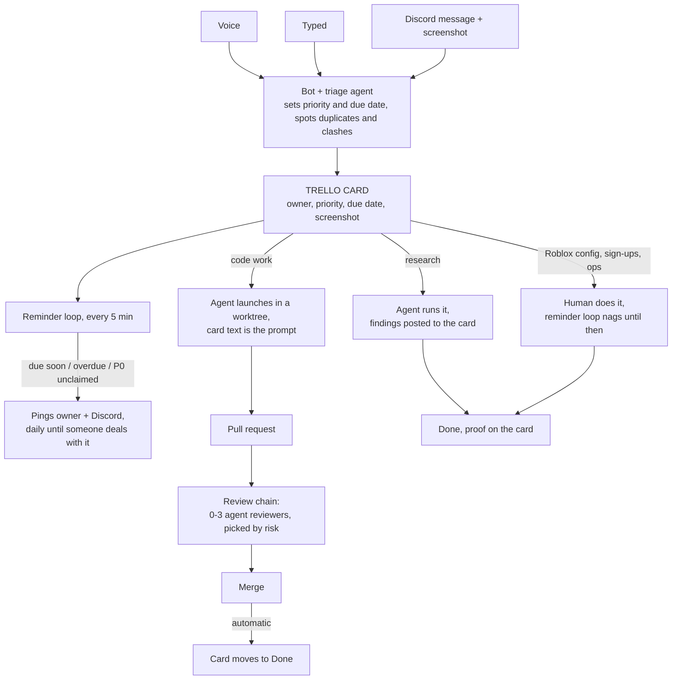

# The plan, simply

Every piece of work becomes a Trello card with a priority and a due date.
Robots watch the cards: they remind people, launch agents, review code, and report back.
You talk to it by voice or Discord. Nothing important lives only in chat.

## The picture

## Where data lives

| Data | Lives in |
|---|---|
| Tasks, priorities, due dates, screenshots | Trello. One workspace, the 11 boards, plus an HQ board |
| Code and PRs | GitHub, as now |
| Which card = which agent session, reviews, proof | `~/.agent-workspace/task-records.json` on each machine (already exists) |
| Team stuff both machines/people need (AI usage left, member list) | one small private git repo, synced automatically |
| Names and nicknames for voice ("the kpop game", people) | one config file per machine |
| Chat | Discord. Disposable. Anything that matters becomes a card within minutes |

## The rules

| Priority | Means | The system does |
|---|---|---|
| P0 | emergency, done or downgraded in 24h | pings until someone claims it, escalates at 24h |
| P1 | promised, has a deadline | due date required, reminded 24h before + on the day + daily after |
| P2 | normal (the default) | reminded only if you gave it a date |
| P3 | someday | silent; idle agents chip away at the small "1% better" ones |

Nothing auto-bumps priority. Overdue stays loud until a human finishes, moves, or kills it.
Old P2s get surfaced after 30 days, old P3s after 90, so nothing rots silently.

## How it hooks into what you already have

| You have | What happens to it |
|---|---|
| Orchestrator | Already contains the Trello client, card-to-agent launcher, PR automation, task records. Most of it is just switched on and configured. New code: the reminder loop and the triage agent |
| Jarvis voice (branch #1043) | Gets merged. "Make a card on Zoo, P1, due Friday" works by voice. Cheap local model answers fast stuff, Claude only for real work |
| Discord bot | Kept. Learns to attach screenshots to the card, set priority and due date from your words, and reply with the card link |
| ADHD system | Stays its own private app. Its phone/hotkey capture gets one new route: "this is a studio task" sends it to Trello instead of your personal list |
| Your 2 computers | Each publishes its remaining Claude/Codex/Grok budget to the shared repo. You see both in the header. Assign work to the other machine by assigning the card; it launches there |
| Teammates | Same: their orchestrator shows on the shared repo, you see their budget, you assign them a card with a ready-made prompt attached. They press launch |
| CLAUDE.md repos | One script builds each person's CLAUDE.md from shared pieces (their role + their OS + their projects) instead of you maintaining copies |
| Trello vs GitHub Projects | Staying on Trello. GitHub Projects gets a small trial on the Orchestrator board later; if it wins, the swap is one file, because the new code never talks to Trello directly |

## Build order

1. Merge the four stuck branches (voice, reviews, supervisor, Discord watcher). Most of the system is already written and sitting there.
2. One Trello sitting: one workspace, HQ board, same lists everywhere, Priority field on every board. Flip on the "PR merged moves the card" automation.
3. Build the reminder loop. This is the piece that makes forgetting impossible.
4. Upgrade the Discord bot (images, due dates, card links).
5. Review chains: risky code gets 2-3 agent reviewers, trivial code gets none.
6. Hook up voice inputs and the picker that chooses which AI runs a task based on budget left.
7. Team budgets + second computer.
8. The CLAUDE.md builder.

That's it. Trello holds the work, the orchestrator does the work, Discord and voice are
how you talk to it, and the reminder loop makes sure nothing is ever forgotten again.
