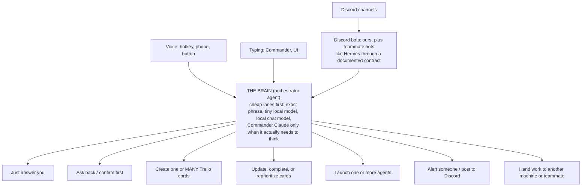

# The plan, simply

Trello holds the work. An agent brain decides what happens at every step: nothing in
this system is a fixed pipe. Agent Workspace is where you see and steer all of it.

## What happens when you say something

Every arrow out of the brain is a choice it makes per request. A Trello card is one
possible outcome, not the outcome.

## What happens to a card

- The triage agent proposes priority, due date, duplicates, and clashes with other work.
  Small calls apply themselves with the reasoning left as a comment; anything P0/P1 or
  destructive waits for a human yes.
- The reminder loop is budgeted, not a spam cannon. Interruptions go through the same
  budget the supervisor uses: so many per hour, minimum gaps, quiet hours, low-grade
  stuff batched into a digest. Only a P0 is allowed to keep breaking through. Everything
  else escalates by channel (UI first, Discord later) and then lands in the Friday
  close-out, where a human decides: finish it, reschedule it, or kill it. Overdue never
  disappears, and it also never turns into infinite pinging.

## How code work finishes

Launch from the card (one call, card text becomes the prompt, agent works in a
worktree) -> PR opens. Then review is sized by risk, and it is not always automatic:

| Change | Review |
|---|---|
| Trivial (docs, tiny fix) | none |
| Normal | one agent reviewer |
| Dangerous (player data, economy, launch week) | several agents with different lenses, PLUS a human |

Merging is a person's call unless that repo and change type is explicitly allowed to
auto-merge. Some teammates can merge on some projects and never on others; that policy
lives in config, not in vibes. Whoever merges, however they merge, the card then moves
itself. That last step is the only automatic part.

## Where results go

Wherever fits: a PR, a card comment, a doc, a Discord reply. Research might end as
findings on the card, or as a PR, or both. The only rule: the card links to wherever
the result lives, so the trail is never lost.

## What you see in Agent Workspace

This all surfaces in the app you already run:

| Surface | Shows |
|---|---|
| Terminal grid | every agent working, grouped by worktree; Focus / Review / Background mode filters what is on screen |
| Queue / Review Inbox | everything waiting on a review or a decision, sorted by priority and tier |
| Tasks panel | your Trello boards inside the app, including the all-boards combined view |
| Jarvis panel (Alt+J) | what the supervisor found, the batched digest, Discord work it spotted, proposals waiting for your yes |
| Header | your remaining Claude/Codex/Grok budget; later your teammates' and your other machine's too |
| Voice | the realtime manager speaks only on real changes (agent finished, something broke), silent in background mode |

## Where data lives

| Data | Lives in |
|---|---|
| Tasks, priorities, due dates, screenshots | Trello: one workspace, the 11 game boards, plus the Trello HQ board (the studio-level board: one status card per game, decisions needed, cross-game blockers) |
| Code and PRs | GitHub, as now |
| Which card = which agent session, reviews, proof | `~/.agent-workspace/task-records.json` on each machine (already exists) |
| Team data every machine needs (AI budget left, member list) | one small private git repo, synced automatically |
| Names and nicknames for voice ("the kpop game", people) | one config file per machine |
| Chat | Discord. Disposable. Anything that matters gets captured out of it within minutes |

## How it hooks into what you already have

| You have | What happens to it |
|---|---|
| Orchestrator / Agent Workspace | The center. Already contains the Trello client, card-to-agent launcher, PR automation, task records. Mostly switched on and configured; new code is the reminder loop, triage duty, and the brain's routing |
| Jarvis (branch #1043) | Gets merged. It IS the brain's voice lanes: exact-phrase, tiny model, local chat, Commander |
| Discord bot | Kept and upgraded: screenshots onto cards, priority and due date from your words, card-link replies. Teammate bots (Hermes) plug in through a published contract instead of scraping logs |
| ADHD system | Stays its own private app. Its phone/hotkey capture gets one route: "studio task" goes to the studio instead of your personal list |
| Your 2 computers | Each publishes remaining budget to the shared repo; the brain can route a launch to whichever machine has headroom |
| Teammates | You see their budget, you assign a card with a ready-made prompt attached, their orchestrator offers it for launch |
| CLAUDE.md repos | One script builds each person's CLAUDE.md from shared pieces (role + OS + projects) instead of hand-maintained copies |
| Trello vs GitHub Projects | Staying on Trello. Small trial later on the Orchestrator board; the new code never talks to Trello directly, so swapping stays cheap |

## Build order

1. Merge the four stuck branches (voice/brain, reviews, supervisor, Discord watcher). Most of this is already written.
2. One Trello sitting: workspace, the Trello HQ board, same lists everywhere, Priority field. Turn on "merged PR moves the card".
3. Build the reminder loop with the interruption budget.
4. Upgrade the Discord bot; publish the contract for teammate bots.
5. Review chains sized by risk, human gates included.
6. Voice inputs plus the budget-aware routing.
7. Team budgets and the second computer.
8. The CLAUDE.md builder.
